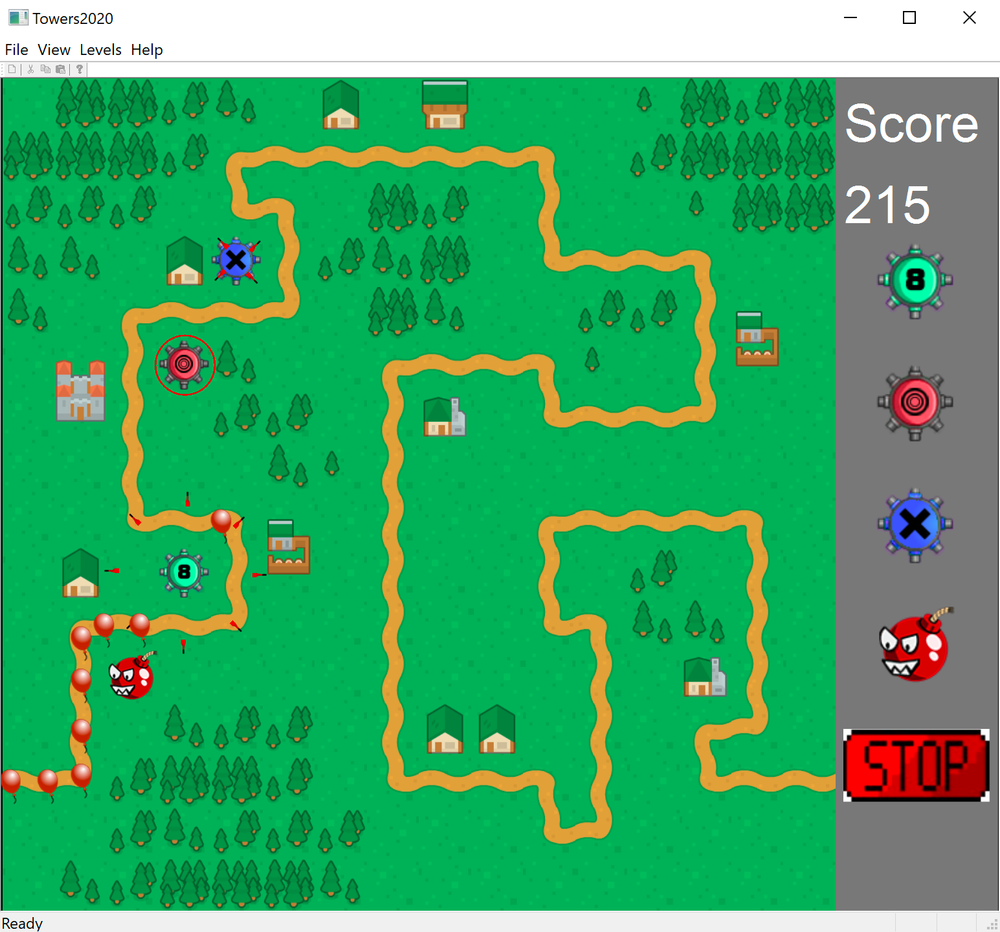

# Towers-2020
A Bloons Tower Defense style game. This was developed as a team project as part of CSE 335 - Object Oriented Software Development at Michigan State University Fall 2020.

## Overview
The goal of the game is to pop all balloons traveling down a road before they reach the end. Before the level begins, the player can build towers around the map that automatically shoot down the balloons. Once the level starts, points are earned for each balloon popped and subracted for each balloon that makes it through. There are three levels, each with different maps and increasing number of balloons.

## Towers
 The eight tower shoots projectiles in 8 directions every 5 seconds, popping all bloons it touches.

 The ring tower generates a ring every 5 seconds, popping all baloons in its radius.

 The cross tower shoots projectiles every 5 seconds, alternating between + and X shapes.

 The bomb explodes 3 seconds apart in the order they were placed, popping all balloons in its radius.

## Level Format
Each level is loaded from XML format. This makes it easy to create new levels.

First the level is defined. The width and height of the map are specified, as well as the starting coordinate from which balloons will spawn.

`<level width="16" height="16" start-y="7" start-x="0">`

Levels are comprised of 4 types of tiles. These are defined in the `<items>` XML tag:
* Road - Balloons will spawn and travel down the road
  * `<road id="i001" x="0" y="7"/>`
* Open - Towers can be placed on Open tiles
  * `<open id="i002" x="0" y="7"/>`
* House - Towers cannot be placed on Houses
  * `<house id="i003" x="0" y="7"/>`
* Trees - Towers cannot be placed on Trees
  * `<trees id="i004" x="0" y="7"/>`
  
Items are assigned an id, which are defined in the `<declarations>` XML tag. This defines the image used to the tile, and for road tiles define their direction
* `<road id="i001" image="roadEW.png" type="EW"/>`
* `<open id="i002" image="grass1.png"/>`
* `<house id="i003" image="house1.png"/>`
* `<trees id="i004" image="trees1.png"/>`
  
Examples of levels in XML format can be found in /levels/
